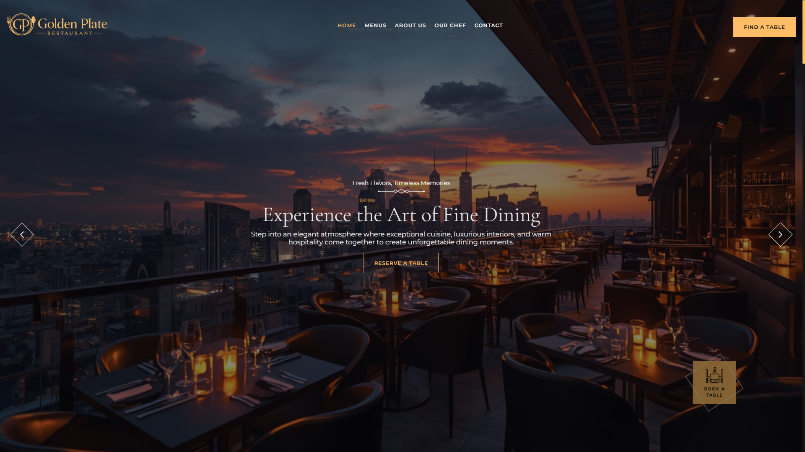
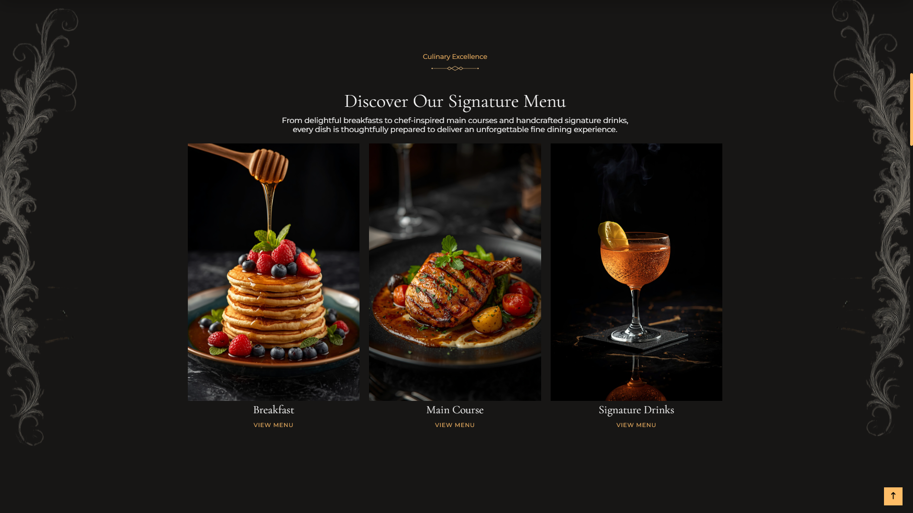
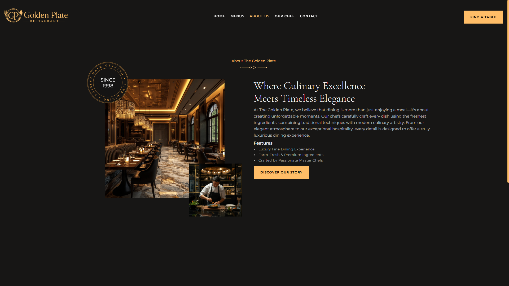
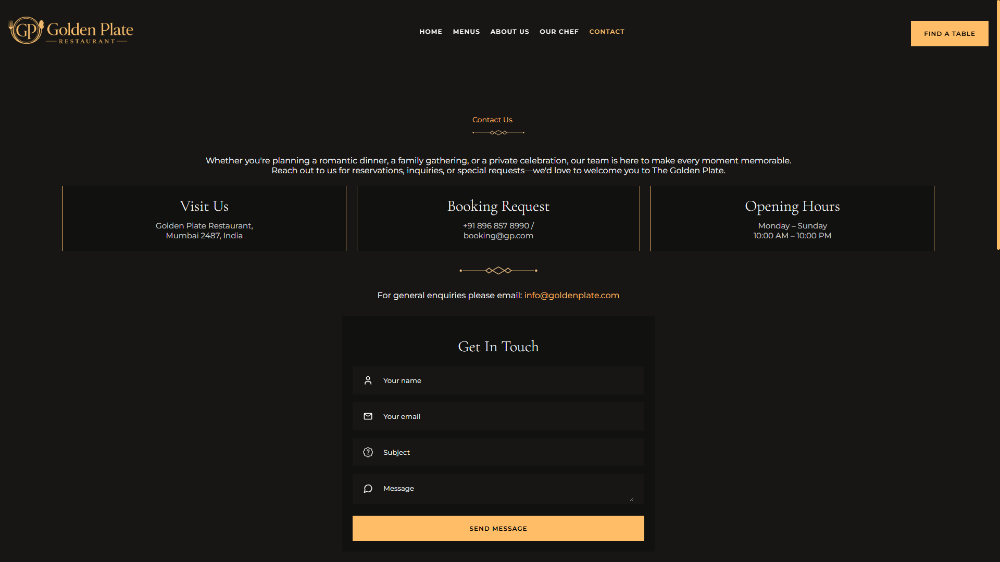

# 🍽️ The Golden Plate Restaurant

A premium full-stack restaurant website built with modern web technologies.


## 🛠️ Tech Stack

### Frontend
- React.js
- Vite
- JavaScript
- Axios
- React Router DOM

### Backend
- Node.js
- Express.js
- MongoDB
- Mongoose

### Security & Middleware
- CORS
- Helmet.js
- dotenv

### Deployment
- Frontend: Netlify
- Backend: Render
- Database: MongoDB Atlas


## 🍽️ About The Project

**The Golden Plate Restaurant** is a modern full-stack restaurant web application designed to provide an elegant and seamless online dining experience.

The platform features a premium restaurant interface where users can explore the menu, discover chef specialties, reserve tables, and contact the restaurant easily through an interactive and responsive design.

Built with the **MERN Stack**, this project combines a fast React.js frontend with a powerful Node.js and Express.js backend, connected to MongoDB for efficient data management. The application also includes API integration using Axios and enhanced security with middleware like CORS and Helmet.

The main focus of this project is to deliver a luxurious restaurant experience with clean UI, responsive layouts, smooth navigation, and reliable backend functionality.

### ✨ Key Highlights:
- Premium restaurant landing page with modern UI
- menu and chef showcase
- Online table reservation system
- Contact form with backend integration
- Secure API handling
- Fully responsive design for all devices
- Optimized full-stack architecture

## ⚙️ Installation & Setup

### 1. Clone the repository

```
git clone https://github.com/abdullah-full-stack-dev/golden-plate-restaurant.git
cd golden-plate-restaurant
```

---

### 2. Install dependencies

#### Frontend

```
cd Frontend
npm install
npm run dev
```

#### Backend

```
cd Backend
npm install
npm start
```

## 🔐 Environment Variables

Create a `.env` file in the Backend folder:

```
PORT=4000
MONGO_URI=your_mongodb_connection
JWT_SECRET=your_secret_key
BREVO_API_KEY=your_brevo_api_key
EMAIL_USER=your_email
EMAIL_PASS=your_smtp_key
```

---

## 🌐 Live Demo

👉 https://golden-plate-restaurant.netlify.app/

---

## API Features

#### Reservation API
1 Create table reservation
2 Store customer details
3 Manage booking information

#### Contact API
1 Send customer messages
2 Store contact inquiries

---

## 📸 Screenshots

### 🏠 Home Page


### 🏠 Menu Page


### 🏠 About Page


### 🏠 Contact Page

